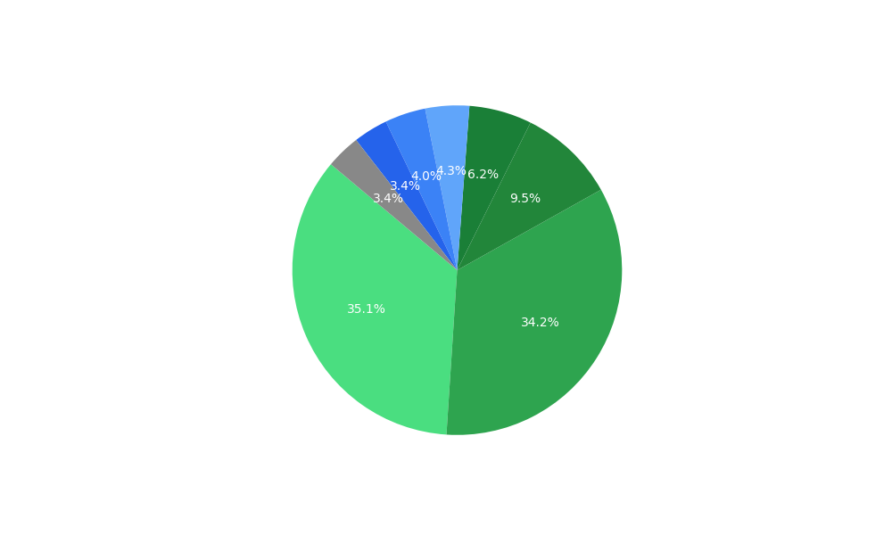

# 🚀 Ananth's Engineering Log
### ⚡ Automated Career Tracker
- **Total Problems Solved:** 205 🔥
- **System Status:** Online 🟢

### 🎓 Progress
- **Foundation** `[██████████]` **100%** *(25/25)*
- **DSA (Data Structures)** `[██░░░░░░░░]` **23%** *(21/88)*
- **Core (SQL/CS Fund)** `[█░░░░░░░░░]` **17%** *(5/28)*
- **System Design (LLD/HLD)** `[░░░░░░░░░░]` **0%** *(0/126)*

### ⏳ Latest 10 Solved
| Date | Problem Name | Topic | Source |
| :--- | :--- | :--- | :--- |
| 10/02/2026 | Column Sum | Array | Scaler |
| 09/02/2026 | Row Sum | Array | Scaler |
| 08/02/2026 | Maximum subarray sum of fixed length | Array | Scaler |
| 07/02/2026 | Maximum Subarray | Array | Scaler |
| 06/02/2026 | Elements Removal | Array | Scaler |
| 06/02/2026 | Noble Integer | Array | Scaler |
| 05/02/2026 | Arithmetic Progression? | Array | Scaler |
| 05/02/2026 | Kth Smallest Element | Array | Scaler |
| 05/02/2026 | Best Time to Buy and Sell Stocks | Array | Scaler |
| 04/02/2026 | Special Index | Array | Scaler |

[View Full Archive](https://ananth9911.github.io/Ananth-Porfolio/)