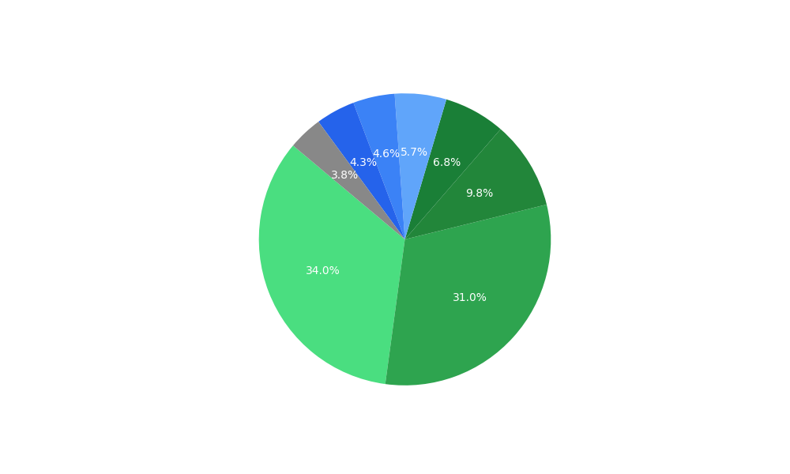

# 🚀 Ananth's Engineering Log
### ⚡ Automated Career Tracker
- **Total Problems Solved:** 343 🔥
- **System Status:** Online 🟢

### 🎓 Progress
- **Foundation** `[██████████]` **100%** *(25/25)*
- **DSA (Data Structures)** `[██████░░░░]` **65%** *(60/92)*
- **Core (SQL/CS Fund)** `[██░░░░░░░░]` **28%** *(8/28)*
- **System Design (LLD/HLD)** `[░░░░░░░░░░]` **0%** *(0/124)*

### ⏳ Latest 10 Solved
| Date | Problem Name | Topic | Source |
| :--- | :--- | :--- | :--- |
| 11/04/2026 | Recover Binary Search Tree | Tree | Scaler |
| 11/04/2026 | Morris Inorder Traversal | Tree | Scaler |
| 11/04/2026 | LCA in BST | Tree | Scaler |
| 10/04/2026 | Kth Smallest Element In BST | Tree | Scaler |
| 10/04/2026 | Least Common Ancestor | Tree | Scaler |
| 09/04/2026 | LRU Cache | LinkedList | Scaler |
| 09/04/2026 | Remove Loop from Linked List | LinkedList | Scaler |
| 09/04/2026 | Intersection of Linked Lists | LinkedList | Scaler |
| 08/04/2026 | Palindrome List | LinkedList | Scaler |
| 08/04/2026 | Sort List | LinkedList | Scaler |

[View Full Archive](https://ananth9911.github.io/Ananth-Porfolio/)