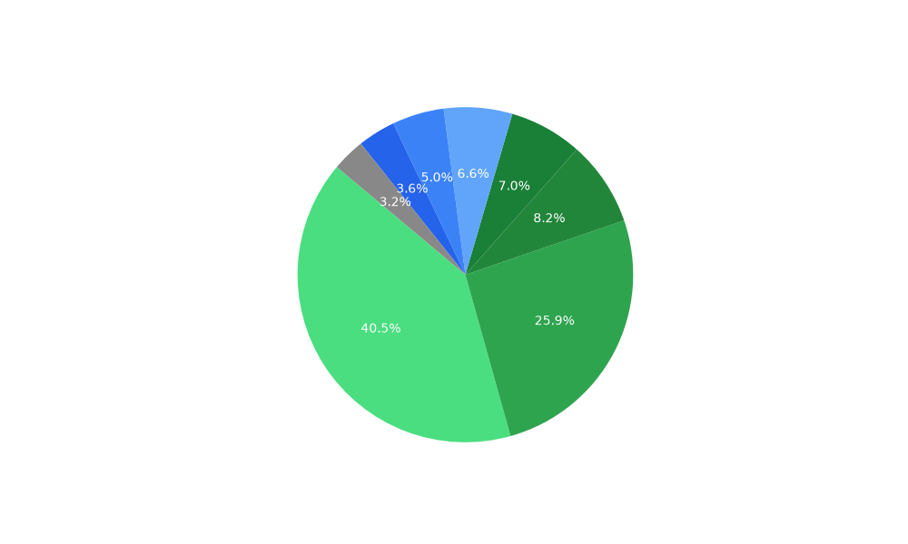

# 🚀 Tracker
- **Total Problems Solved:** 496 🔥
- **Overall Mastery:** 98% Smooth | Hard: 147 | Medium: 122
- **System Status:** Online 🟢

### 🎓 Curriculum Progress
*(Could not load plan)*

### ⏳ Latest 10 Solved
| Date | Problem | Topic | Difficulty | Phase |
| :--- | :--- | :--- | :---: | :---: |
| 29/07/2026 | Max Consecutive Ones III | Array | 🟡 | Smooth |
| 28/07/2026 | Longest Substring Without Repeating Characters | Array | 🟡 | Smooth |
| 27/07/2026 | Longest Repeating Character Replacement | Array | 🟡 | S1 |
| 26/07/2026 | Get Equal Substrings Within Budget | Array | 🟡 | Completed |
| 25/07/2026 | Sentence Similarity III | Array | 🟡 | Completed |
| 24/07/2026 | Fruit Into Baskets | Array | 🟡 | S1 |
| 23/07/2026 | Find K Closest Elements | Array | 🔴 | S1 |
| 22/07/2026 | Two Sum II - Input Array Is Sorted | Array | 🟢 | Completed |
| 21/07/2026 | String Compression | Array | 🟡 | S1 |
| 20/07/2026 | Path Sum II | Tree | 🟢 | Completed |

[→ View Full Archive](https://ananth9911.github.io/Ananth-Porfolio/)