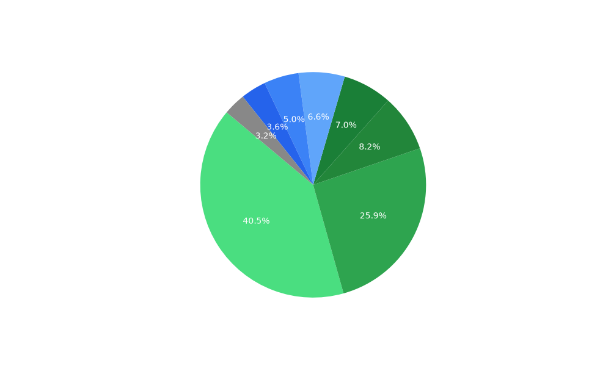

# 🚀 Tracker
- **Total Problems Solved:** 525 🔥
- **Overall Mastery:** 62% Smooth | Hard: 147 | Medium: 151
- **System Status:** Online 🟢

### 🎓 Curriculum Progress
*(Could not load plan)*

### ⏳ Latest 10 Solved
| Date | Problem | Topic | Difficulty | Phase |
| :--- | :--- | :--- | :---: | :---: |
| 12/10/2026 | Subarray Product Less Than K | Array | 🟡 | Smooth |
| 11/10/2026 | Flatten Nested List Iterator | Stack | 🟡 | Completed |
| 10/10/2026 | Remove All Adjacent Duplicates In String II | Queue | 🟡 | Completed |
| 09/10/2026 | Last Stone Weight | Queue | 🟡 | Completed |
| 08/10/2026 | Find All Anagrams in a String | Hashing | 🟡 | Completed |
| 08/10/2026 | Sort Characters By Frequency | Hashing | 🟡 | Completed |
| 07/10/2026 | Find Pivot Index | Hashing | 🟡 | Completed |
| 06/10/2026 | Contiguous Array | Hashing | 🟡 | Completed |
| 05/10/2026 | Find The Index of The First Occurrence in a String | Hashing | 🟡 | Completed |
| 05/10/2026 | Is Subsequence | Hashing | 🟡 | Completed |

[→ Portfolio](https://ananth9911.github.io/Ananth-Porfolio/)